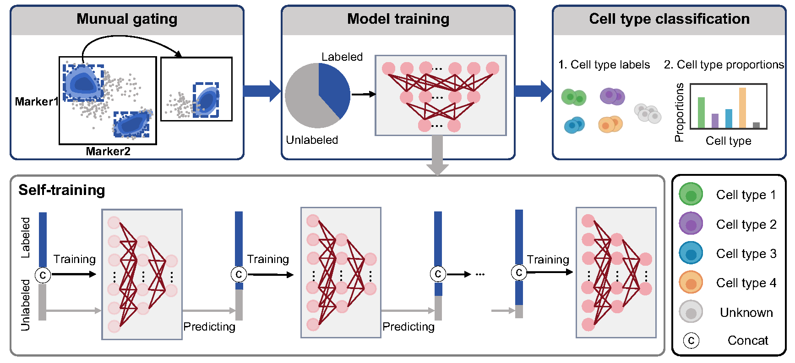
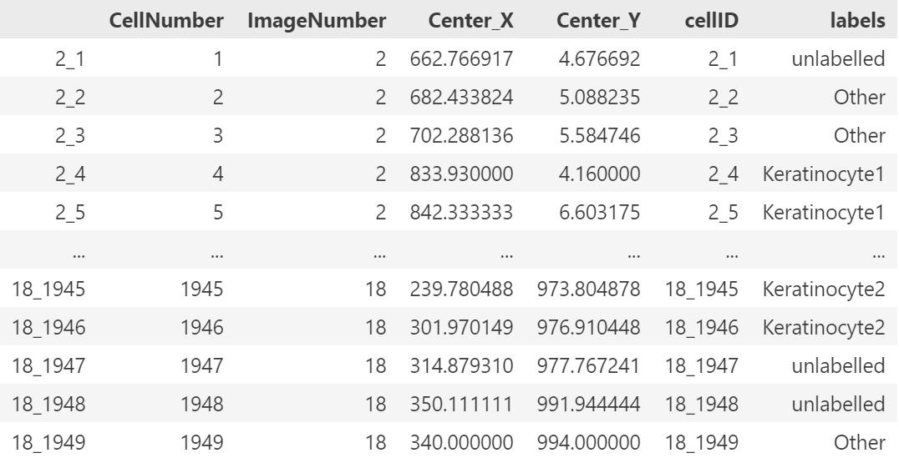

# Clever
Clever (**C**el**L** abundanc**E** quantification using multi-positi**V**e unlab**E**led lea**R**ning) is a semi-automated, deep learning-based computational framework designed to effectively identify and quantify cells from single-cell multiplexed imaging and proteomic datasets. Clever not only accurately classifies cells but also preserves biological interpretability.



## Installation
### Dependencies
```
Python >= 3.8
Pytorch == 1.7.1
```

a. Set up a python environment (conda virtual environment is recommended).

```shell
conda create -n clever python=3.8
git clone https://github.com/xmuyulab/Clever-XMBD.git
cd Clever
conda activate clever
```

b. Install Pytorch.

```shell
conda install pytorch==1.7.1 torchvision==0.8.2 torchaudio==0.7.2 cudatoolkit=11.0 -c pytorch
```

c. Install required python packages.

```shell
pip install -r requirements.txt
```

## Data preparation and preprocessing

Clever requires a `.h5ad` file as input. This file should contain data in the `AnnData` format with the following structure:
- `AnnData.X` contains the **arcsinh-transformed marker expression data**, where rows represent individual cells and columns correspond to marker proteins.
- `AnnData.var` stores marker metadata (only marker names are sufficient).
- `AnnData.obs` stores cell metadata.

Below is an example of the **cell metadata**. The rows correspond to the same cells as those in the marker expression data, while the columns contain detailed information about the cells. The metadata must include **gating labels** (e.g. `labels`), obtained through the gating process.



You have three options to provide input data:
- Directly provide a `.h5ad` file.
- Provide a `.fcs` file containing flow cytometry data (including marker expression) and a `.csv` file containing corresponding cell metadata.
- Provide a `.csv` file containing marker expression data, with rows representing individual cells and columns corresponding to marker proteins, along with a `.csv` file containing cell metadata.

If you choose either of the latter two options, you can use the following command to create your own `.h5ad` file:
```shell
python create_h5ad.py -data ./example/IMC_data.fcs -meta ./example/IMC_meta_data.csv -outdir ./example/
```
- `data`: Path to the marker expression data file.
- `meta`: Path to the cell metadata file.
- `outdir`: Path to store the output `.h5ad` file.

**Note**: For parameters not listed above, refer to the usage instructions by running `python create_h5ad.py -h`.

## Usage

Clever leverages both the labeled and unlabeled portions of the dataset for training and subsequently predicts the labels for the unlabeled cells.
```shell
python run.py -data ./example/IMC_data.h5ad -outdir ./result -k 3 -wp 5 -ungated unlabelled Other -label labels
```
- `data`: Specifies the path to the input data file.
- `outdir`: Directory where the output results will be saved.
- `k`: Clever randomly splits the unlabeled cells into $k$ subsets, and combine each subset with the labeled cells to create $k$ training datasets. It’s recommended to choose a value for $k$ that ensures a balanced mix of labeled and unlabeled data in each training dataset. In this example, $k$ is set to 3.
- `wp`:  Specifies the weight assigned to positive risk in the loss function. The default value is 5.
- `ungated`: Includes all labels for cells that were not assigned to any predefined cell type during the gating process. In the example above, "unlabelled" and "Other" represent the labels for cells that were not classified into any predefined cell type.
- `label`: Name of the column in the metadata that stores the gating labels.
 
Clever produces two output files in the `outdir` folder: a cell type prediction file and a cell type proportion file.


## Citation
Lin Y, Chen X, Lin Y, et al. Accurate Cell Abundance Quantification using Multi-positive and Unlabeled Self-learning[J]. bioRxiv, 2024: 2024.10. 12.617956. https://www.biorxiv.org/content/10.1101/2024.10.12.617956v1.abstract